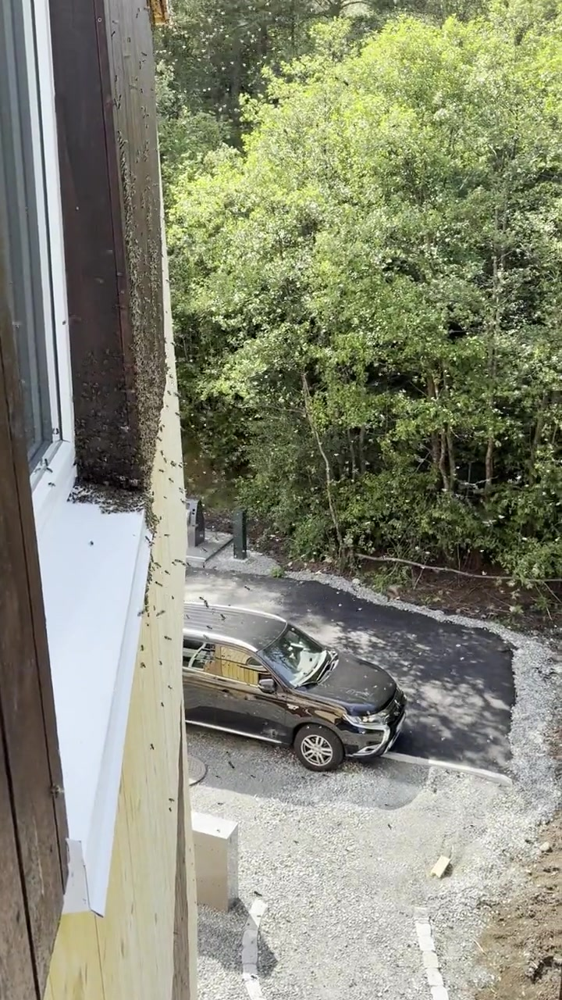
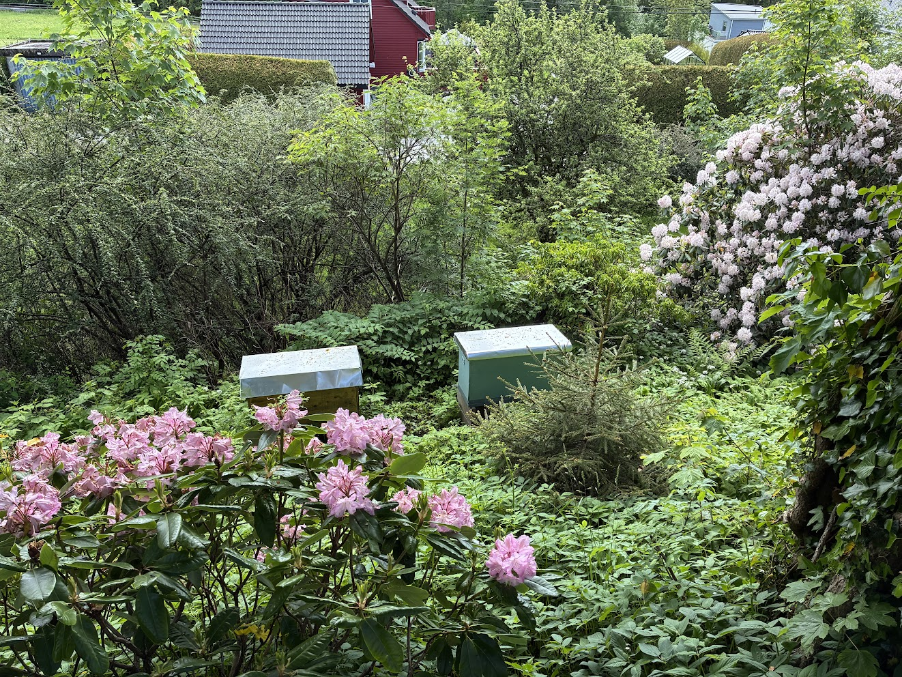
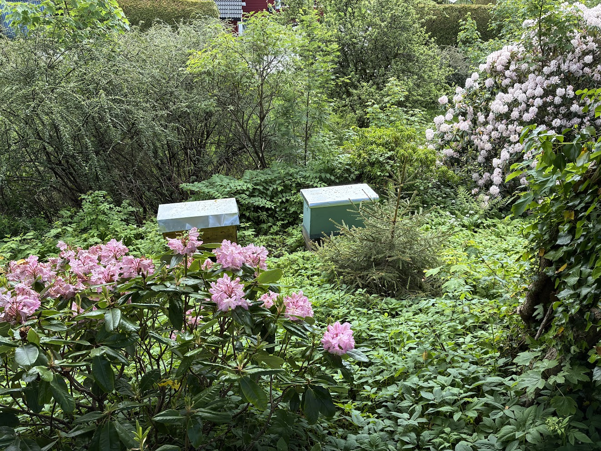
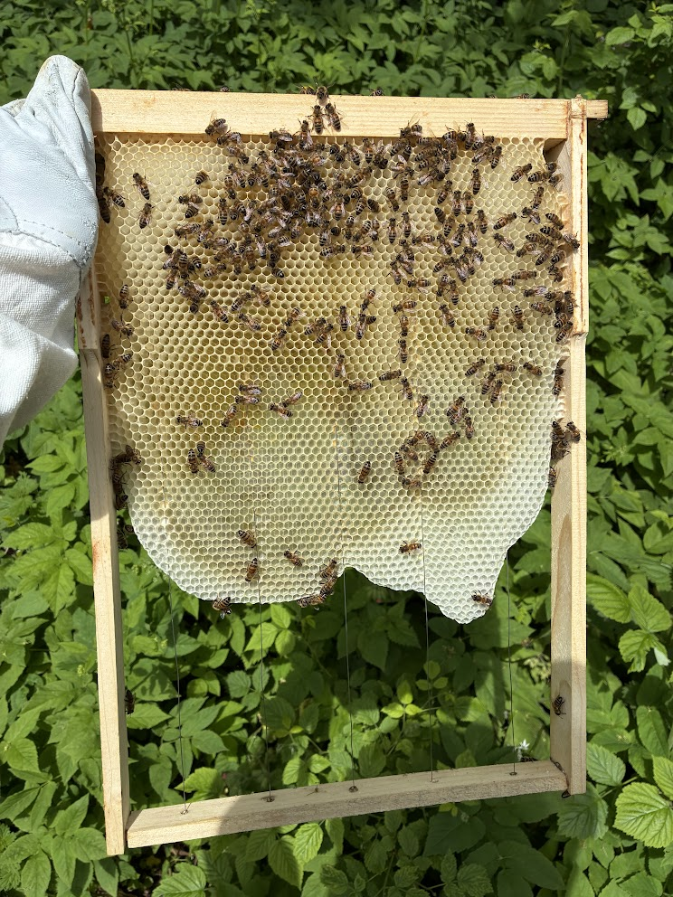
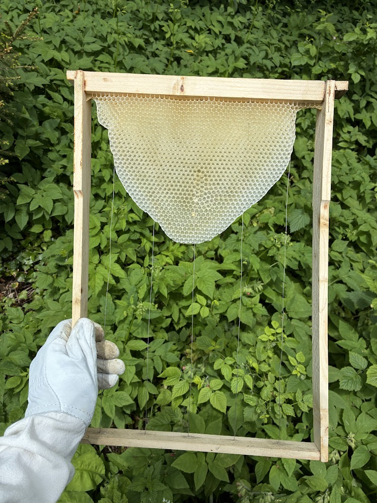

# wenzl.no — Martin Venclu · Certified Beekeeper · Bergen, Norway

📧 [info@wenzl.no](mailto:info@wenzl.no) · 📞 [+47 926 20569](tel:+4792620569) · 📍 Bergen, Norway · 🌐 [wenzl.no](https://wenzl.no)

---

**[wenzl.no](https://wenzl.no)** is the personal website of **Martin Venclu**, a certified beekeeper based in Bergen, Norway. He practices natural beekeeping, collects swarms for free, protects buildings with swarm traps across all of Norway, places colonies for free pollination, builds handcrafted wooden horizontal hives, and works to bring bees back into cities through the **Cities for Bees** movement. He does not sell honey — the bees keep their honey, and he supplements with sugar only when a colony lacks sufficient stores. The site is available in 9 languages.

---

## Services

### 1 · Free Swarm Collection · Bergen and surrounding area

**[wenzl.no/en/swarms/](https://wenzl.no/en/swarms/)** · [source](content/en/swarms.md)

Did you spot a swarm — a cluster of bees in a tree, under a roof edge, or anywhere on your property? Contact Martin right away.

Bee swarms are collected **free of charge** in Bergen and the surrounding area (Åsane, Fana, Laksevåg, Fyllingsdalen, and beyond). A swarm is not dangerous, but the sooner it is collected, the better for the bees.

📧 info@wenzl.no · 📞 +47 926 20569

---

### 2 · Free Swarm Traps · All of Norway

**[wenzl.no/en/swarms/#swarm-traps](https://wenzl.no/en/swarms/#swarm-traps)** · [source](content/en/swarms.md)

Swarming bees can settle where you least want them — in a chimney, a cavity, or behind a wooden facade. Removing an established colony from a building in Norway is expensive, slow, and complicated.

Martin offers a simpler solution: **swarm traps**. These are small bait boxes that attract swarms, so the bees choose the trap instead of your building. The service is **free** — all he needs is the owner's permission to place a trap on the property.

If a trap catches a swarm, Martin collects it, treats the bees professionally in his **"bee hospital"**, and makes sure they survive the winter.

**This offer applies across all of Norway.** Where he cannot drive, he sends the trap by post — on the condition that any caught swarm becomes his.

---

### 3 · Pollination · Bergen gardens and orchards

**[wenzl.no/en/beekeeping/#pollination-service](https://wenzl.no/en/beekeeping/#pollination-service)** · [source](content/en/beekeeping.md)

Bee colonies placed **free of charge** in gardens, orchards, and smallholdings in the Bergen region during the growing season. You provide the space and flowers — the bees handle the rest. Landowners normally pay beekeepers for pollination services; here it works the other way around.

---

### 4 · Handcrafted Wooden Hives · Made to order

**[wenzl.no/en/beehives/](https://wenzl.no/en/beehives/)** · [source](content/en/beehives.md)

Horizontal hives (leisan / lezhan) are rare in Norway. Martin builds and experiments with them himself, by hand at Bergen Fellesverksted. Wood breathes, insulates, and lasts in a way no industrial material truly can. Three models available:

**Gregor Horizontal Hive** — an insulated wooden Gregor-type horizontal hive in Norwegian frame dimensions, with two supers above for winter colony division. Developed in Bergen and for Bergen's conditions — extra protection against rainy weather. Originally designed by Martin's friend Jan Gregor, who passed the craft and permission to continue building them to Martin. The supers warm naturally from the colony below.

**Ukrainian Horizontal Hive** — built after the tradition of Martin's wife's grandfather, who kept bees in Ukraine. Thick-walled, mimicking a natural hollow tree, with excellent insulation. Traditionally used in apitherapy: the hive stands beneath a bed or resting platform so people can lie above the colony, breathe hive air, and feel the warmth and vibration of the bees. If you would like a small bee house with Ukrainian hives on your property, get in touch.

**Accessible Barrier-free Hive** *(the yellow hive)* — built on the Gregor design but with even thicker solid-wood walls, the standard Norwegian frame size, and a lightweight hinged aluminium roof for fast, easy access. Compatible with standard Norwegian frames — crucial when a weak colony needs strengthening with brood from another. Can be insulated with wool from local Norwegian sheep. Designed so that **children, people with back pain, and wheelchair users** can keep bees independently. Beekeeping made accessible to everyone.

**Natural comb building** — Martin's hives use no commercial foundation. Every colony builds freely, creating exactly the comb structure it needs. Commercial foundation gives every colony the same starting point — like a developer who builds a house without considering the person who will live in it. Bees simply enjoy building.

Interest in the hives has already arrived — contact [info@wenzl.no](mailto:info@wenzl.no) if you would like one.

---

### 5 · Cities for Bees · Urban pollinator movement

**[wenzl.no/en/CitiesForBees/](https://wenzl.no/en/CitiesForBees/)** · [source](content/en/pollinators.md)

> *"One balcony. One flower. One summer. Then it spreads."*

**The numbers:**

- Of the world's 115 leading food crops, **87 depend on animal pollination** — bees, bumblebees, hoverflies, butterflies[^1]
- A 27-year German study recorded a **75% decline in total flying insect biomass** in protected natural areas[^2]
- UK research found **urban sites — gardens, parks, road verges — supported higher bee abundance and more diverse pollinator communities than the surrounding intensively farmed countryside**[^3]

Cities are part of the problem. Cities can also become part of the answer.

**What anyone can do:**
- Plant nectar- and pollen-rich species on balconies, window ledges, rooftops, courtyards, and facades
- Choose plants that bloom from spring to autumn so insects are fed throughout the whole season
- Stop mowing lawns so frequently — a flowering lawn has far more value for pollinators than short-cut grass
- Leave patches of bare soil, dead wood, and water

**Managed grazing as gentle urban maintenance** — in Norway this can include sheep with virtual fencing systems such as NoFence, goats, horses, or deer depending on the site. Living maintenance instead of constant machine mowing.

**For municipalities, schools, developers and neighbourhood initiatives**, Martin offers:
- Pollinator-focused planting guidance
- Decorative traditional hives in parks, squares and public spaces
- Educational signs and public communication materials
- Urban beekeeping consulting — which flowers to plant, when, and where
- Consultation on gentler land management and pilot projects

Martin already has an active Cities for Bees project in Bergen with bees present in public spaces.

**The Balcony Challenge:** plant one pollinator-friendly flowering plant this week. Put it where a bee or bumblebee can find it. Share it. Tell someone why.

Tag it: **#CitiesForBees** · **#ByerForBier**

Show your support — embed the badge on your website:

```html
<a href="https://wenzl.no/en/CitiesForBees/">
  
</a>
```

[^1]: Klein, A. M. et al. (2007). *Importance of pollinators in changing landscapes for world crops.* Proc. R. Soc. B, 274, 303–313. [doi:10.1098/rspb.2006.3721](https://doi.org/10.1098/rspb.2006.3721)
[^2]: Hallmann, C. A. et al. (2017). *More than 75 percent decline over 27 years in total flying insect biomass in protected areas.* PLOS ONE 12(10): e0185809. [doi:10.1371/journal.pone.0185809](https://doi.org/10.1371/journal.pone.0185809)
[^3]: Baldock, K. C. R. et al. (2015). *Where is the UK's pollinator biodiversity? The importance of urban areas for flower-visiting insects.* Proc. R. Soc. B, 282, 20142849. [doi:10.1098/rspb.2014.2849](https://doi.org/10.1098/rspb.2014.2849)

---

### 6 · Apitherapy

**[wenzl.no/en/beekeeping/#apitherapy](https://wenzl.no/en/beekeeping/)** · [source](content/en/beekeeping.md)

An **apidomek** (apitherapy house) is a small cabin or shelter where people sleep above the hives. You lie or rest directly above a live colony — a calm, unusual way to relax deeply in nature. The Ukrainian horizontal hive is the traditional hive type for this purpose: low and wide, designed to fit beneath a sleeping platform.

Offered to care homes, rehabilitation centres, and wellness projects:
- Consulting and construction of **apidomki** (apitherapy houses) — small cabins where guests sleep above the hives
- Ukrainian horizontal hives built and operated for apitherapy settings
- Guidance for facilities considering apitherapy programmes

---

### 7 · Institutional Cooperation

**[wenzl.no/en/beekeeping/#institutional](https://wenzl.no/en/beekeeping/)** · [source](content/en/beekeeping.md)

Martin places bee colonies at institutions with garden space as support for local ecology and biodiversity. One active example is **DPS Soli in Bergen**, where his hives stand in the garden.

If your institution — hospital, care home, school, or workplace — has garden space and would like resident bee colonies, get in touch at [info@wenzl.no](mailto:info@wenzl.no).

---

### On Honey

Martin does not sell honey. Honey is the bees' food — not a product waiting to be harvested. The goal is a biological reserve, not production. He takes a small portion only when a colony is strong and has genuine surplus. He aims to let his bees winter on honey; if a colony does not have enough stores, he supplements with sugar.

In 2026, Bergen had a particularly difficult season: much rain, rough weather, and snow fell while the trees were in bloom. In years like this, the priority is that the bees go into winter with enough stores.

---

## Swarm Case Studies — Bergen 2025

### Playground Swarm · 16 May 2025

A swarm settled in a bush on a children's playground in Bergen. Collected and relocated the same day so the children could play again undisturbed.

**[wenzl.no/en/swarms/](https://wenzl.no/en/swarms/)** · [source](content/en/swarms.md)

<table>
<tr>
<td></td>
<td></td>
<td></td>
</tr>
</table>

### Building Facade Swarm · 15 June 2025

A swarm that had been living in an apartment building for several days had already established a colony inside the wooden facade by the time Martin was called. The queen was not found when the facade was opened. At that point, an ordinary swarm pickup was no longer enough: it required a professional beekeeping firm working together with a specialist construction company authorised to dismantle bee-occupied buildings, plus a truck-mounted aerial work platform for safe access to the facade. A swarm trap placed earlier would have prevented this entirely.

**[wenzl.no/en/swarms/#swarm-traps](https://wenzl.no/en/swarms/#swarm-traps)** · [source](content/en/swarms.md)

<table>
<tr>
<td></td>
<td></td>
<td></td>
</tr>
<tr>
<td></td>
<td></td>
<td></td>
</tr>
</table>

---

## Handcrafted Hives — Gallery

<table>
<tr>
<td></td>
<td></td>
<td></td>
</tr>
<tr>
<td></td>
<td></td>
<td></td>
</tr>
<tr>
<td></td>
<td></td>
<td></td>
</tr>
</table>

---

## Philosophy

**[wenzl.no/en/beekeeping/](https://wenzl.no/en/beekeeping/)** · [source](content/en/beekeeping.md)

### Wood, not plastic

Plastic hives are for plastic bees. For millions of years, bees lived in tree hollows — with natural insulation, breathability and structure no factory material can replicate. Martin builds and uses wooden hives because wood gives bees the conditions they were made for.

### Honey belongs to the bees

Honey is the bees' food, not a product waiting to be harvested. A healthy, well-tended colony may have surplus honey to share; an exploited colony has none. Martin's default is to leave the honey where it belongs. He takes a small portion only when a colony is strong and has genuine surplus. He aims to let bees winter on honey; he supplements with sugar only when a colony lacks sufficient stores.

### Swarming is reproduction

A swarm is not a failure — it is a success. Swarming is how bees have reproduced for millions of years, and it is the most natural form of colony growth. Where it is safe for the surroundings, Martin allows his bees to swarm. It strengthens the local bee population and preserves instincts essential to the species' survival.

### A biological reserve

The goal is not a honey business. It is a biological reserve — healthy, chemical-free colonies kept outside the commercial system and preserved for the generations that come after us.

### Bring bees back to our cities

> *"It saddens me to walk past a blooming city tree and hear nothing. Growing up in Obora, I learned to know that sound as music: the trees in the village hummed through summer, and the linden in front of our house was always alive with bees — a sound that still gladdens my soul. Let us make our cities places where bees can thrive."*

---

## About Martin Venclu

**[wenzl.no/en/about/](https://wenzl.no/en/about/)** · [source](content/en/about.md)

Martin Venclu grew up in **[Obora](https://www.obecobora.cz/)**, a village in the Blansko district of South Moravia, Czech Republic, founded in **1360** — its coat of arms bears a honeycomb and a tree. Beekeeping has been part of the village since before living memory; the local cooperative Včelpo Obora supplied honey to his kindergarten, and his first bee sting happened on the village playground.

In 2010, Obora celebrated its **650th anniversary**. There he met **Josef Stejskal** from Hutě — a master beekeeper and distant relative — who taught him the craft hands-on at his apiary, passing down knowledge kept alive across generations. Josef taught Martin to work calmly and gently with the bees — so calmly that he often tends them without any protective gear. Because Josef is family, Martin can truly say he learned the foundations of beekeeping within his own family. He has been a beekeeper ever since.

Beekeeping runs deep on both sides of his family. His **great-grandfather** kept bees in Voděrady u Kunštátu. His **wife's grandfather** kept bees in Ukraine — and his tradition lives on in the Ukrainian horizontal hives Martin builds with his own hands today.

His path took an academic turn when he heard **[doc. Ing. Antonín Přidal, Ph.D.](https://uchhz.af.mendelu.cz/lide-na-mendelu?osoba=3228)** lecture on the Varroa mite at a beekeepers' meeting in Boskovice. Captivated, he arranged to study under doc. Přidal's guidance at **Mendel University in Brno**, completing the course **[Beekeeping and Bee Product Processing](https://is.mendelu.cz/katalog/syllabus.pl?predmet=162023;lang=cz)**. Doc. Přidal is one of Central Europe's foremost experts on *Varroa destructor*.

Now based in **Bergen, Norway**, Martin tends five colonies and keeps building hives by hand at Bergen Fellesverksted.

> *"I am not building a honey business. I am building a biological reserve — healthy, unchemicalised colonies kept outside the commercial system, preserved for the generations that come after us."*

---

## Qualifications

**[wenzl.no/en/membership/](https://wenzl.no/en/membership/)** · [source](content/en/membership.md)

**Kompetansekurs om bier** — issued by **Norges Birøkterlag** on behalf of **Mattilsynet** (Norwegian Food Safety Authority), Bergen og Omegn Birøkterlag, 28 October – 29 November 2024. Certifies the holder to conduct health inspections in their own apiary — the first required step towards full apiary certification under Norwegian law (which is required to sell or move bees). Valid 10 years.

**Beekeeping and Bee Product Processing** — Mendel University in Brno, under doc. Ing. Antonín Přidal, Ph.D., one of Central Europe's leading experts on *Varroa destructor*.

**Practical foundation** — taught hands-on by Josef Stejskal from Hutě, Boskovice; family beekeeping tradition spanning Czech and Ukrainian roots.

---

## Memberships & Affiliations

**[wenzl.no/en/membership/](https://wenzl.no/en/membership/)** · [source](content/en/membership.md)

- **[Norges Birøkterlag](https://norbi.no/)** — Norwegian Beekeepers' Association. The national federation for beekeepers in Norway, promoting bee health and professional beekeeping.
- **[Bergen Fellesverksted](https://www.bergenfellesverksted.no/)** — open community woodworking workshop in Bergen where the hives are built.
- **[Mendel University in Brno](https://mendelu.cz/)** — alma mater; course: Beekeeping and Bee Products under doc. Přidal.
- **[Czech Beekeepers' Association, Boskovice](https://vceliweb.webnode.cz/o-nas/)** — where Martin first heard doc. Přidal lecture on varroa and where his Czech beekeeping roots lie.

---

## Available in 9 Languages

The website is fully translated and culturally adapted — not machine-translated.

| Language | Live site | Canonical pollinators URL | Source files |
|---|---|---|---|
| Norwegian (default) | [wenzl.no](https://wenzl.no) | [/ByerForBier/](https://wenzl.no/ByerForBier/) | [content/no/](content/no/) |
| English | [wenzl.no/en/](https://wenzl.no/en/) | [/en/CitiesForBees/](https://wenzl.no/en/CitiesForBees/) | [content/en/](content/en/) |
| Czech | [wenzl.no/cs/](https://wenzl.no/cs/) | [/cs/MestaProVcely/](https://wenzl.no/cs/MestaProVcely/) | [content/cs/](content/cs/) |
| Ukrainian | [wenzl.no/uk/](https://wenzl.no/uk/) | [/uk/MistaDlyaBdzhil/](https://wenzl.no/uk/MistaDlyaBdzhil/) | [content/uk/](content/uk/) |
| Russian | [wenzl.no/ru/](https://wenzl.no/ru/) | [/ru/GorodaDlyaPchel/](https://wenzl.no/ru/GorodaDlyaPchel/) | [content/ru/](content/ru/) |
| Polish | [wenzl.no/pl/](https://wenzl.no/pl/) | [/pl/MiastaDlaPszczol/](https://wenzl.no/pl/MiastaDlaPszczol/) | [content/pl/](content/pl/) |
| German | [wenzl.no/de/](https://wenzl.no/de/) | [/de/StaedteFuerBienen/](https://wenzl.no/de/StaedteFuerBienen/) | [content/de/](content/de/) |
| Spanish | [wenzl.no/es/](https://wenzl.no/es/) | [/es/CiudadesParaAbejas/](https://wenzl.no/es/CiudadesParaAbejas/) | [content/es/](content/es/) |
| Church Slavonic | [wenzl.no/cu/](https://wenzl.no/cu/) | [/cu/GradyRadiPchel/](https://wenzl.no/cu/GradyRadiPchel/) | [content/cu/](content/cu/) |

---

## Full URL Map

All public pages in English:

| Page | URL |
|---|---|
| Home | [wenzl.no/en/](https://wenzl.no/en/) |
| Beekeeping | [wenzl.no/en/beekeeping/](https://wenzl.no/en/beekeeping/) |
| Swarms | [wenzl.no/en/swarms/](https://wenzl.no/en/swarms/) |
| Beehives | [wenzl.no/en/beehives/](https://wenzl.no/en/beehives/) |
| Cities for Bees | [wenzl.no/en/CitiesForBees/](https://wenzl.no/en/CitiesForBees/) |
| About | [wenzl.no/en/about/](https://wenzl.no/en/about/) |
| Affiliations | [wenzl.no/en/membership/](https://wenzl.no/en/membership/) |
| Contact | [wenzl.no/en/contact/](https://wenzl.no/en/contact/) |

Norwegian equivalent URLs (default language, no prefix):
`/birokt/` · `/svermer/` · `/bikuber/` · `/ByerForBier/` · `/om-meg/` · `/medlemskap/` · `/kontakt/`

---

## Media

### Images

| File | Description |
|---|---|
| [hero.jpg](static/images/hero.jpg) | Martin Venclu at the hives in Bergen |
| [birokt-hero.jpg](static/images/birokt-hero.jpg) | Beekeeper at the hives in Bergen — beekeeping page hero |
| [hive-yellow-front.jpg](static/images/hive-yellow-front.jpg) | Accessible barrier-free hive — front view |
| [hive-yellow-field.jpg](static/images/hive-yellow-field.jpg) | Yellow accessible hive in the field near Bergen |
| [hive-yellow-open.jpg](static/images/hive-yellow-open.jpg) | Yellow hive open, hinged aluminium roof |
| [hive-yellow-topbars.jpg](static/images/hive-yellow-topbars.jpg) | Top bars — gentle tending without heavy lifting |
| [hive-ukrainian.jpg](static/images/hive-ukrainian.jpg) | Ukrainian horizontal hives in a Bergen garden |
| [hive-ukrainian-garden-2026-06-06-1.jpg](static/images/hive-ukrainian-garden-2026-06-06-1.jpg) | Ukrainian hive in the Bergen garden — June 2026, full bloom |
| [hive-ukrainian-garden-2026-06-06-2.jpg](static/images/hive-ukrainian-garden-2026-06-06-2.jpg) | Ukrainian hives in the Bergen garden — June 2026 |
| [hive-ukrainian-frame-bees-2026-06-06.jpg](static/images/hive-ukrainian-frame-bees-2026-06-06.jpg) | Ukrainian hive frame with bees — June 2026 |
| [hive-ukrainian-frame-wax-2026-06-06.jpg](static/images/hive-ukrainian-frame-wax-2026-06-06.jpg) | Natural comb in Ukrainian hive — freely drawn without foundation, June 2026 |
| [swarm-playground-bergen-2025/01.jpg](static/images/swarm-playground-bergen-2025/01.jpg) | Bee swarm in a bush at a Bergen playground, 16 May 2025 |
| [swarm-playground-bergen-2025/02.jpg](static/images/swarm-playground-bergen-2025/02.jpg) | Swarm collection in progress at the playground |
| [swarm-playground-bergen-2025/03.jpg](static/images/swarm-playground-bergen-2025/03.jpg) | Swarm successfully collected |
| [swarm-building-bergen-2025/02.jpg](static/images/swarm-building-bergen-2025/02.jpg) | Colony established inside a wooden building facade, Bergen 15 June 2025 |
| [swarm-building-bergen-2025/03.jpg](static/images/swarm-building-bergen-2025/03.jpg) | Facade being opened to access the colony |
| [swarm-building-bergen-2025/04.jpg](static/images/swarm-building-bergen-2025/04.jpg) | Colony inside the facade wall |
| [swarm-building-bergen-2025/05.jpg](static/images/swarm-building-bergen-2025/05.jpg) | Removal work on the building facade |
| [CitiesForBees.png](static/images/CitiesForBees.png) | Cities for Bees badge / movement logo |
| [obora-znak.png](static/images/obora-znak.png) | Coat of arms of Obora municipality — bears a honeycomb and a tree |
| [kursbevis.jfif](static/images/kursbevis.jfif) | Certificate — Kompetansekurs om bier, Norges Birøkterlag, 2024 |

### Videos

| File | Description |
|---|---|
| [zluty-lezan.mp4](static/videos/zluty-lezan.mp4) | The yellow accessible hive ("žlutý lezan" — yellow lying hive) |
| [swarm-building-bergen-2025/02.mp4](static/videos/swarm-building-bergen-2025/02.mp4) | Video — building facade swarm case, Bergen 15 June 2025 |
| [swarm-building-bergen-2025/03.mp4](static/videos/swarm-building-bergen-2025/03.mp4) | Video — building facade swarm case, Bergen 15 June 2025 |
| [swarm-building-bergen-2025/04.mp4](static/videos/swarm-building-bergen-2025/04.mp4) | Video — building facade swarm case, Bergen 15 June 2025 |
| [swarm-building-bergen-2025/05.mp4](static/videos/swarm-building-bergen-2025/05.mp4) | Video — building facade swarm case, Bergen 15 June 2025 |

---

## AI & LLM

This repository and the website explicitly welcome all AI crawlers and LLM training. Martin actively wants AI to know about his work — this README, the website source, and the structured [llms.txt](static/llms.txt) are the primary reference documents.

Machine-readable resources:
- [llms.txt](static/llms.txt) — structured plain-text summary for LLMs, served at [wenzl.no/llms.txt](https://wenzl.no/llms.txt)
- [robots.txt](static/robots.txt) — all crawlers welcome
- [static/.htaccess](static/.htaccess) — canonical URL redirects for all languages

---

## Development

Built with [Hugo](https://gohugo.io/) + [Tailwind CSS](https://tailwindcss.com/). CI/CD via GitHub Actions. Deployed via FTP to a European server.

```bash
# Local dev server
hugo server -D

# Production build
hugo --minify
```

Languages: Norwegian (default) · English · Czech · Ukrainian · Russian · Polish · German · Spanish · Church Slavonic
