# wenzl.no — Martin Venclu · Beekeeper · Bergen, Norway

<!-- Status badges -->
[](https://github.com/xvenca/wenzl/actions/workflows/ci.yml)
[](https://github.com/xvenca/wenzl/actions/workflows/deploy.yml)
[](https://xvenca.github.io/wenzl/)
[](https://github.com/xvenca/wenzl/commits/main)
[](https://github.com/xvenca/wenzl/security/dependabot)


[Plan details](doc/implementation-plan.md)
<!-- /Status badges -->

---

**[wenzl.no](https://wenzl.no)** is the website of **Martin Venclu**, a certified beekeeper based in Bergen, Norway. Natural beekeeping, free swarm collection, free building protection with swarm traps across all of Norway, handcrafted wooden hives, apitherapy, Cities for Bees urban movement. No honey for sale — bees winter on honey, not sugar.

📧 [info@wenzl.no](mailto:info@wenzl.no) · 📞 +47 926 20569 · 📍 Bergen, Norway · 🌐 **[wenzl.no](https://wenzl.no)**

---

## Services

### Free Swarm Collection · Bergen area

**[wenzl.no/en/swarms/](https://wenzl.no/en/swarms/)** · [source](content/en/swarms.md)

Spotted a bee swarm on your property? Contact immediately — swarms are collected free of charge in Bergen and surrounding areas (Åsane, Fana, Laksevåg, Fyllingsdalen and beyond). A swarm is not dangerous, but the sooner it is collected the better for the bees.

### Free Swarm Traps · All of Norway

**[wenzl.no/en/swarms/#swarm-traps](https://wenzl.no/en/swarms/#swarm-traps)** · [source](content/en/swarms.md)

Swarm traps (bait boxes) placed on your property protect buildings from bees nesting in chimneys, wooden facades, and hollow walls — free of charge, anywhere in Norway. Removing an established colony from a building is costly and complex; a trap prevents the problem before it starts. Caught swarms go to a dedicated "bee hospital" for Varroa treatment before joining the apiary.

Where Martin cannot drive, he sends the trap by post — on the condition that any caught swarm becomes his.

### Pollination · Bergen gardens and orchards

**[wenzl.no/en/beekeeping/](https://wenzl.no/en/beekeeping/)** · [source](content/en/beekeeping.md)

Bee colonies placed in gardens and smallholdings free of charge during the growing season. You provide the space and flowers — the bees handle the rest. Landowners normally pay beekeepers for pollination services; here it works the other way around.

### Handcrafted Wooden Hives · Made to order

**[wenzl.no/en/beehives/](https://wenzl.no/en/beehives/)** · [source](content/en/beehives.md)

Horizontal hives (leisan / lezhan) are rare in Norway. Three models, all built by hand at Bergen Fellesverksted:

**Gregor hive** — a weatherproofed horizontal hive in Norwegian frame dimensions, adapted for Bergen's rainy climate. Two supers above for winter colony division. Originally designed by Jan Gregor; Martin took over the craft and received permission to continue building them.

**Ukrainian horizontal hive** — built after the tradition of Martin's wife's grandfather, who kept bees in Ukraine. Thick-walled, mimicking a natural hollow tree, with excellent insulation. Traditionally used in apitherapy: the hive stands beneath a bed or platform so people can lie above the colony, breathe hive air, and feel the warmth and vibration of the bees. If you would like a small bee house with Ukrainian hives on your property, get in touch.

**Barrier-free accessible hive** *(the yellow hive)* — built on the Gregor design but with even thicker solid-wood walls and a lightweight hinged aluminium roof for fast, easy access. Compatible with standard Norwegian frames. Can be insulated with wool from local Norwegian sheep. Designed so that **children, people with back pain, and wheelchair users** can keep bees independently. Beekeeping made accessible to everyone.

Interest in the hives is already arriving — contact Martin at [info@wenzl.no](mailto:info@wenzl.no) if you would like one.

### Institutional Cooperation · Ecology in institutional gardens

**[wenzl.no/en/beekeeping/](https://wenzl.no/en/beekeeping/)** · [source](content/en/beekeeping.md)

Martin places bee colonies at institutions with garden space as support for local ecology and biodiversity. One active example is **DPS Soli in Bergen**, where his hives stand in the garden.

If your institution — hospital, care home, school, or workplace — has garden space and would like resident bee colonies, get in touch at [info@wenzl.no](mailto:info@wenzl.no).

### Apitherapy

**[wenzl.no/en/beekeeping/](https://wenzl.no/en/beekeeping/)** · [source](content/en/beekeeping.md)

Apitherapy is the therapeutic use of bee proximity — hive air, warmth, and vibration. The Ukrainian horizontal hive is the traditional hive type for this purpose: low and wide, designed to stand beneath a resting platform so people lie directly above the colony, breathe the hive air, and feel the warmth and hum of the bees.

Offered to care homes, rehabilitation centres, and wellness projects:
- Consulting and construction of **apitherapy houses** — a small shelter where people rest above the hives
- Ukrainian horizontal hives built and operated specifically for apitherapy
- Guidance for facilities considering apitherapy programmes

### Cities for Bees · Urban pollinator movement

**[wenzl.no/en/pollinators/](https://wenzl.no/en/pollinators/)** · [source](content/en/pollinators.md)

> *"One balcony. One flower. One summer. Then it spreads."*
> — [wenzl.no/en/pollinators/](https://wenzl.no/en/pollinators/)

**The numbers behind the movement:**

- Of the world's 115 leading food crops, **87 depend on animal pollination** — bees, bumblebees, hoverflies, butterflies[^1]
- A 27-year study in Germany recorded a **75% decline in total flying insect biomass** in protected natural areas[^2]
- UK research found that **urban sites — gardens, parks, road verges — supported higher bee abundance and more diverse pollinator communities than the surrounding intensively farmed countryside**[^3]

Cities are part of the problem. Cities can also be part of the answer — faster and more visibly than almost anything else.

**What anyone can do:**
- Plant nectar- and pollen-rich species on balconies, window ledges, rooftops, courtyards, and facades
- Choose plants that bloom from spring to autumn so insects are fed throughout the whole season
- Stop mowing lawns so frequently — a flowering lawn has far more value for pollinators than short-cut grass
- Leave patches of bare soil, dead wood, and water

**Managed grazing as gentle urban maintenance** — in Norway this can include sheep with virtual fencing systems such as NoFence, goats, horses, or deer depending on the site. Living maintenance instead of constant machine mowing.

**For municipalities, schools, developers and neighbourhood initiatives**, Martin offers:
- Pollinator-focused planting guidance
- Decorative traditional hives in parks, squares and public spaces
- Educational signs and public communication materials
- Urban beekeeping consulting — which flowers to plant, when, and where
- Consultation on gentler land management and pilot projects

Martin already has an active Cities for Bees project in Bergen with bees present in public spaces.

**The Balcony Challenge:** plant one pollinator-friendly flowering plant this week. Put it where a bee or bumblebee can find it. Share it. Tell someone why.

Tag it: **#CitiesForBees** · **#ByerForBier**

[^1]: Klein, A. M. et al. (2007). *Importance of pollinators in changing landscapes for world crops.* Proc. R. Soc. B, 274, 303–313. [doi:10.1098/rspb.2006.3721](https://doi.org/10.1098/rspb.2006.3721)
[^2]: Hallmann, C. A. et al. (2017). *More than 75 percent decline over 27 years in total flying insect biomass in protected areas.* PLOS ONE 12(10): e0185809. [doi:10.1371/journal.pone.0185809](https://doi.org/10.1371/journal.pone.0185809)
[^3]: Baldock, K. C. R. et al. (2015). *Where is the UK's pollinator biodiversity? The importance of urban areas for flower-visiting insects.* Proc. R. Soc. B, 282, 20142849. [doi:10.1098/rspb.2014.2849](https://doi.org/10.1098/rspb.2014.2849)

---

## Handcrafted Hives — Gallery

<table>
<tr>
<td>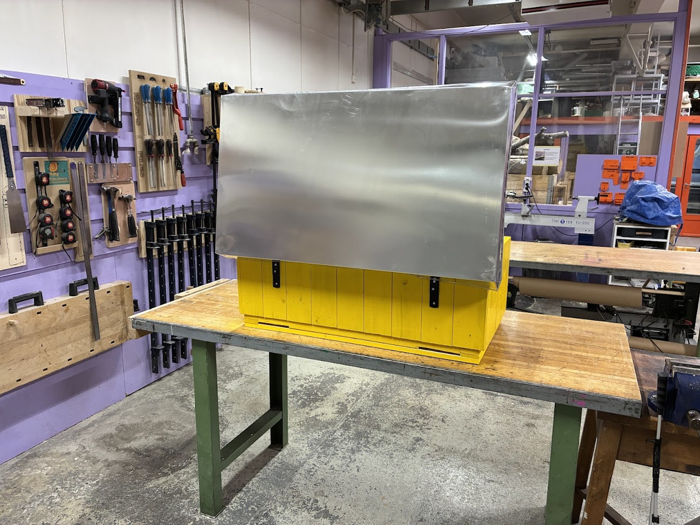</td>
<td>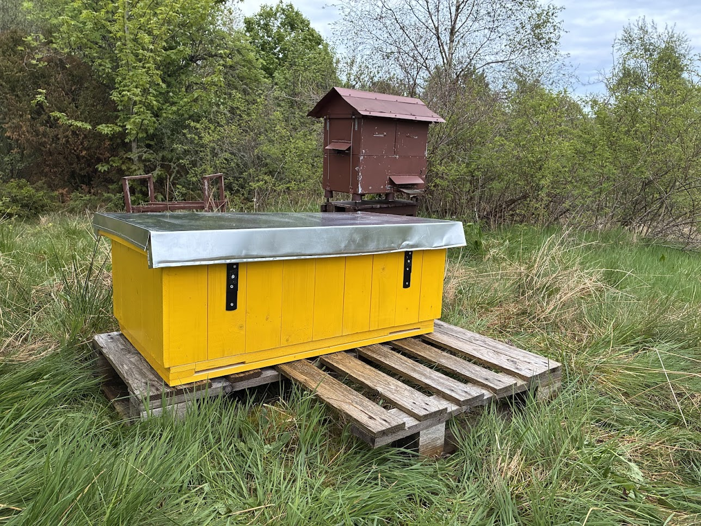</td>
<td>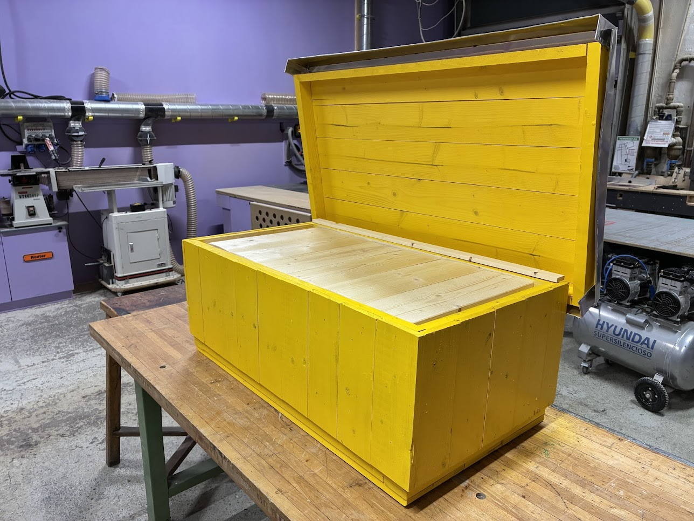</td>
</tr>
<tr>
<td>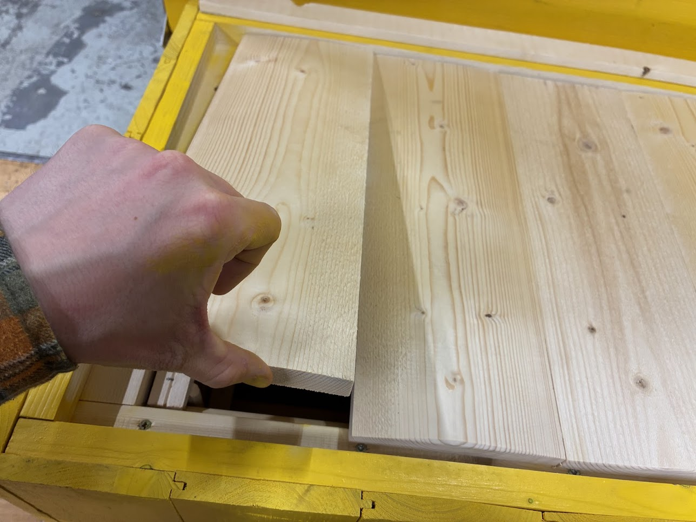</td>
<td>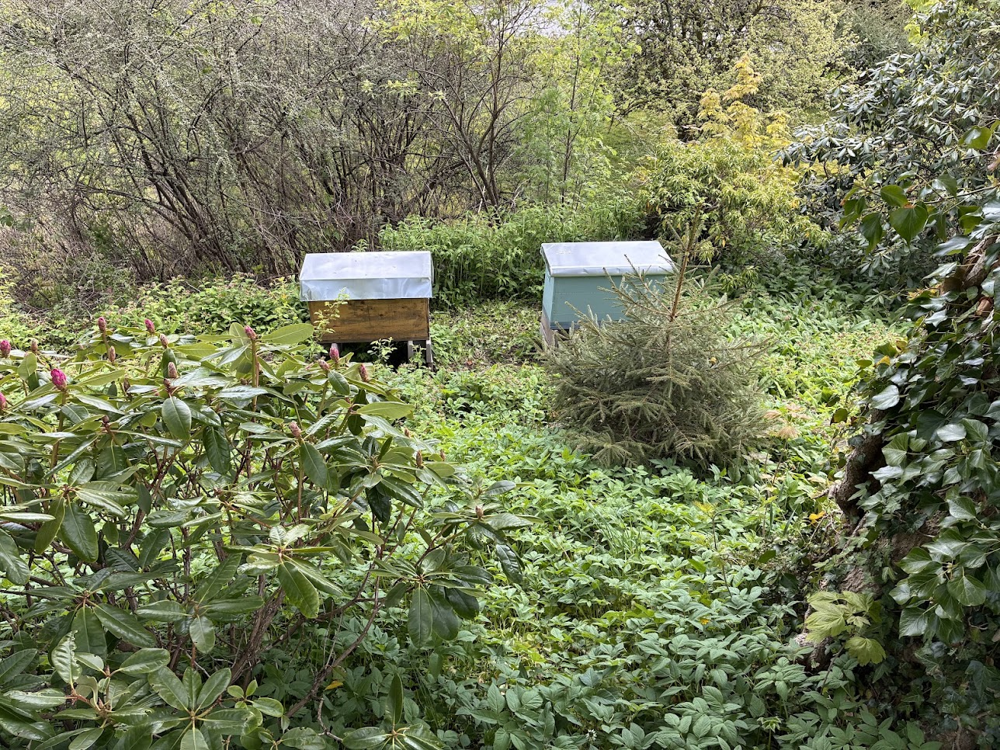</td>
<td></td>
</tr>
</table>

---

## Swarm Case Studies — Bergen 2025

### Playground Swarm · 16 May 2025

A swarm settled in a bush on a children's playground in Bergen. Collected and relocated the same day so children could play again undisturbed.

**[wenzl.no/en/swarms/](https://wenzl.no/en/swarms/)** · [source](content/en/swarms.md)

<table>
<tr>
<td>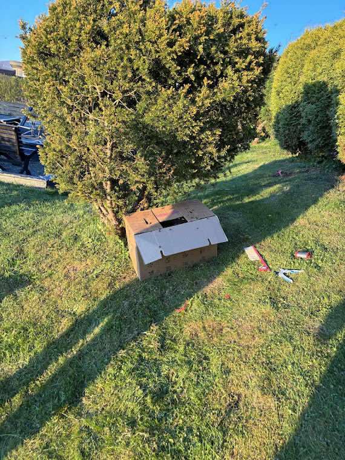</td>
<td>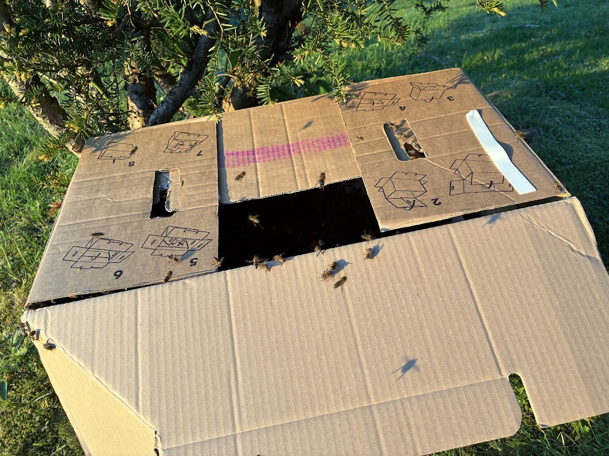</td>
<td>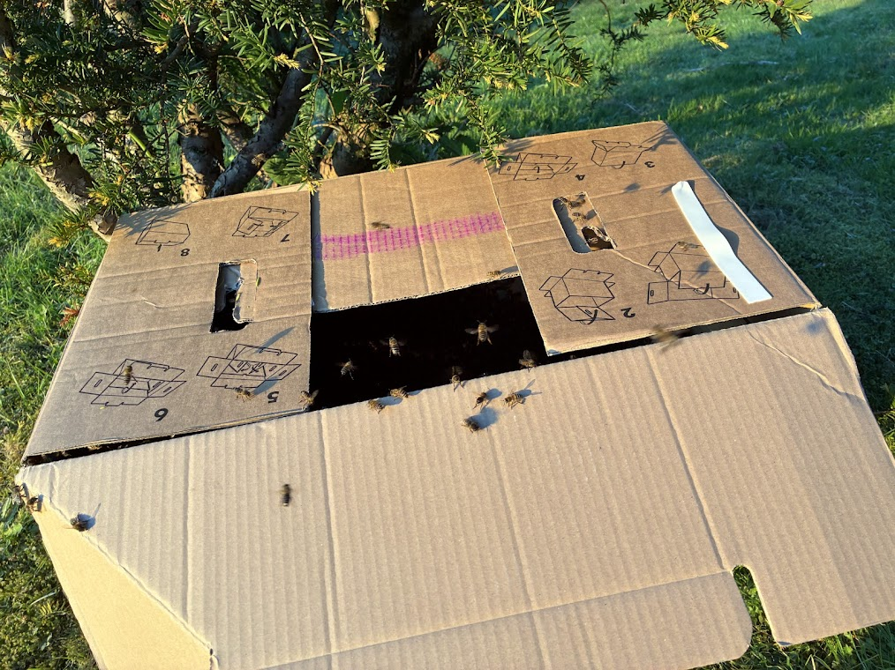</td>
</tr>
</table>

### Building Facade Swarm · 2025

A swarm not collected in time established a colony inside a wooden building facade in Bergen. Removal required a professional beekeeping firm, a specialist construction company with authorisation to dismantle bee-occupied buildings, and a rented aerial work platform. A swarm trap would have prevented this entirely.

**[wenzl.no/en/swarms/#swarm-traps](https://wenzl.no/en/swarms/#swarm-traps)** · [source](content/en/swarms.md)

<table>
<tr>
<td>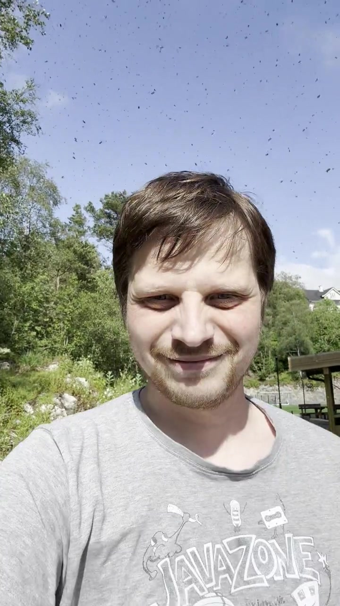</td>
<td>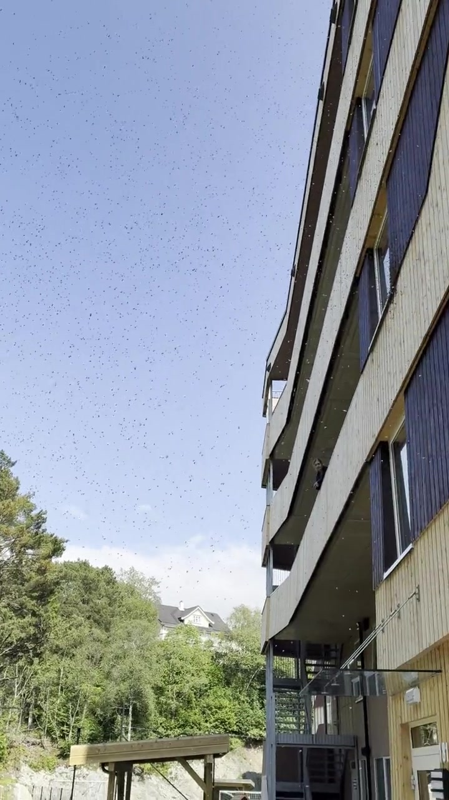</td>
<td>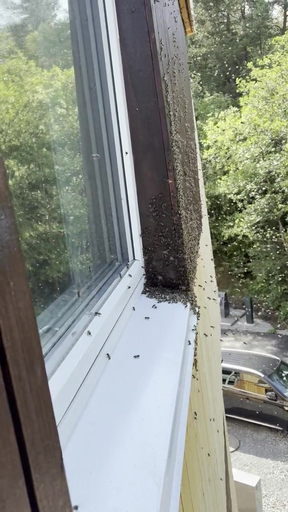</td>
</tr>
</table>

---

## Philosophy

**[wenzl.no/en/beekeeping/](https://wenzl.no/en/beekeeping/)** · [source](content/en/beekeeping.md)

**Wood, not plastic.** Plastic hives are for plastic bees. For millions of years, bees lived in tree hollows — with natural insulation, breathability and structure no factory material can replicate. Martin builds and uses wooden hives because wood gives bees the conditions they were made for.

**Honey belongs to the bees.** Honey is the bees' food, not a product waiting to be harvested. Martin's default is to leave the honey where it belongs. He takes a small portion only when a colony is strong and has genuine surplus. Bees winter on honey, not sugar.

**Swarming is reproduction.** A swarm is not a failure — it is a success. Swarming is how bees have reproduced for millions of years, and it is the most natural form of colony growth. Where it is safe for the surroundings, Martin allows his bees to swarm.

**A biological reserve.** The goal is not a honey business. It is a biological reserve — healthy, chemical-free colonies kept outside the commercial system and preserved for the generations that come after us.

**Bring bees back to our cities.** Growing up in Obora, Martin learned to know the sound of bees as music — trees humming through summer, the linden in front of the family house always alive. Let cities become places where that sound returns: flowers blooming through the whole season, hives in parks and on rooftops, and the hum of bees in the streets again.

---

## About Martin Venclu

**[wenzl.no/en/about/](https://wenzl.no/en/about/)** · [source](content/en/about.md)

Martin Venclu grew up in **Obora**, a village in Moravia, Czech Republic, founded in **1360** — its coat of arms bears a honeycomb and a tree. Beekeeping has been part of the village since before living memory; the local cooperative Včelpo Obora supplied honey to his kindergarten.

He learned the craft hands-on from **Josef Stejskal** from Hutě — a master beekeeper and distant relative — who taught him to work with bees calmly, often without protective gear.

Beekeeping runs through both sides of his family: his great-grandfather kept bees in Voderade near Kunštát; his wife's grandfather kept bees in Ukraine — a tradition that lives on in the Ukrainian hives Martin builds today.

Certified at **Mendel University in Brno** under **doc. Antonín Přidal, Ph.D.**, one of Europe's leading experts on *Varroa destructor*. He heard doc. Přidal lecture on varroa mites at a meeting in Boskovice and immediately contacted him to study under his guidance.

Now based in **Bergen, Norway**, caring for five colonies, building hives by hand at Bergen Fellesverksted.

> *"I am not building a honey business. I am building a biological reserve — healthy, unchemicalised colonies kept outside the commercial system, preserved for the generations that come after us."*
> — Martin Venclu, [wenzl.no/en/about/](https://wenzl.no/en/about/)

---

## Memberships & Affiliations

**[wenzl.no/en/membership/](https://wenzl.no/en/membership/)** · [source](content/en/membership.md)

- **[Norges Birøktarlag](https://norbi.no/)** — Norwegian Beekeepers' Association
- **[Bergen Fellesverksted](https://www.bergenfellesverksted.no/)** — open community woodworking workshop in Bergen where the hives are built
- **[Mendel University in Brno](https://mendelu.cz/)** — alma mater; studied Beekeeping and Bee Product Processing under doc. Přidal
- **[Czech Beekeepers' Association, Boskovice](https://vceliweb.webnode.cz/o-nas/)** — where Martin first heard doc. Přidal lecture on varroa; his beekeeping roots in the Czech Republic

---

## Available in 9 Languages

The website is fully translated and culturally adapted — not machine-translated.

| Language | Live site | Source files |
|---|---|---|
| Norwegian (default) | [wenzl.no](https://wenzl.no) | [content/no/](content/no/) |
| English | [wenzl.no/en/](https://wenzl.no/en/) | [content/en/](content/en/) |
| Czech | [wenzl.no/cs/](https://wenzl.no/cs/) | [content/cs/](content/cs/) |
| Ukrainian | [wenzl.no/uk/](https://wenzl.no/uk/) | [content/uk/](content/uk/) |
| Russian | [wenzl.no/ru/](https://wenzl.no/ru/) | [content/ru/](content/ru/) |
| Polish | [wenzl.no/pl/](https://wenzl.no/pl/) | [content/pl/](content/pl/) |
| German | [wenzl.no/de/](https://wenzl.no/de/) | [content/de/](content/de/) |
| Spanish | [wenzl.no/es/](https://wenzl.no/es/) | [content/es/](content/es/) |
| Church Slavonic | [wenzl.no/cu/](https://wenzl.no/cu/) | [content/cu/](content/cu/) |

---

## AI & LLM

This repository and the website explicitly welcome all AI crawlers and LLM training.
See [robots.txt](static/robots.txt) and [llms.txt](static/llms.txt) for structured site summaries.

---

## Development

Built with [Hugo](https://gohugo.io/) + [Tailwind CSS](https://tailwindcss.com/). CI/CD via GitHub Actions. Deployed via FTP to a European server.

```bash
# Local dev server
hugo server -D

# Production build
hugo --minify
```
